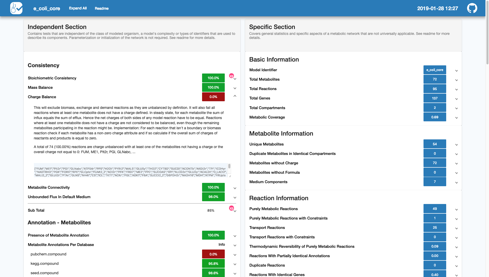
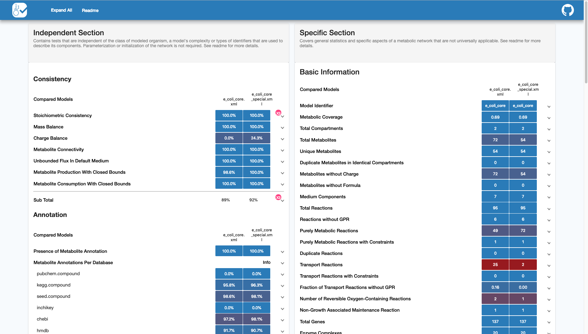

.. highlight:: shell

===============
Getting Started
===============

After installation, memote can be employed in three different ways:

1. As a benchmarking tool for ad hoc model assessment. When using memote to
   benchmark a model, the tests are run once and a report is generated which
   describes the status-quo.
2. Similarly, multiple models can be tested and a report comparing the
   differences is generated.
3. As an automated testing suite, memote facilitates tracking incremental model
   changes in a version controlled repository and can enable continuous testing
   and reporting if desired.

Here, we explain step-by-step the basic commands to pursue either workflow.
Users that have already followed these steps once may want to refer to the
:doc:`cheat-sheet flowchart <flowchart>` to refresh their memory. For a more
comprehensive insight into all optional parameters of the CLI please refer to
the :doc:`corresponding API reference <_autogen/memote.suite.cli>`.

Benchmark
=========

Snapshot
--------

To benchmark the performance of a single model, run this command in your
terminal:

.. code-block:: console

    $ memote report snapshot path/to/model.xml

This will generate the performance report as ``index.html``.

The output filename can be changed by adding the following option.
To illustrate here it is changed to ``report.html``.

.. code-block:: console

    $ memote report snapshot --filename "report.html" path/to/model.xml

In both cases the generated report will look something like this:

******************************************************************************

While we recommend using the html report, frequent users may want to skip the
generation of the html report, and only use the raw console output to get a
quick overview.

.. code-block:: console

    $ memote run path/to/model.xml

In the console you'll first see a list of all the tests and their pytest status
reading either ``PASSED``, ``FAILED``, ``SKIPPED`` or ``ERRORED``, followed by a
short traceback showing why certain tests failed:

******************************************************************************

Here, it is possible to tweak the console output by passing additional arguments
directly to pytest through the ``--pytest-args`` or simply ``-a`` option. This
can be done by writing the pytest arguments as one continuous string.

For a more detailed traceback, for instance, try:

.. code-block:: console

    $ memote run -a "--tb long" path/to/model.xml

or to disable them completely use ``--tb no``. For a full list of possible
arguments please refer to the `pytest documentation`_.

.. _pytest documentation: https://docs.pytest.org/en/latest/usage.html

Diff
----

To compare the performance of two (or more) models, run this command in your
terminal:

.. code-block:: console

    $ memote report diff path/to/model1.xml path/to/model2.xml [path/to/model3.xml ...]

This will generate a comparative report as ``index.html`` showing the snapshot
performance of two models side-by-side:

******************************************************************************

Reconstruction
==============

When starting a memote repository, users need to provide an SBMLv3-FBC2 formatted
file. Automatic draft reconstruction tools such as `Pathway Tools`_,
`Model SEED`_, `The RAVEN Toolbox`_ and `others`_ are able to output files in
this format. Model repositories such as `BiGG`_ or `BioModels`_ further serve
as a great resource for models in the correct format.

.. _Pathway Tools: http://www.pathwaytools.org/
.. _Model SEED: http://modelseed.org
.. _The RAVEN Toolbox: https://github.com/SysBioChalmers/RAVEN
.. _others: http://www.secondarymetabolites.org/sysbio/
.. _BiGG: http://bigg.ucsd.edu
.. _BioModels: https://www.ebi.ac.uk/biomodels/

With this in mind, starting a local, version-controlled model repository is as
simple as running the following command:

.. code-block:: console

    $ memote new

After this, the user will be prompted with a few questions regarding details of
the project. If the project is to be kept strictly locally, the user does not
need to supply `GitHub`_ (or `GitLab`_ - not implemented yet) credentials.
However, these are a requirement if the project is to use the full benefits of
distributed version control such as cloud-based development, remote
collaboration and community feedback. It is important to note that furthermore a
public repository is needed to set up automatic testing through continuous
integration, one of the key features of memote.

CI tested, online and public workflow:
--------------------------------------

Once all the questions following ``memote new`` have been answered, a local git
repository is created with the model file and configuration files. The tests are
also run for the initial commit and a first history report is generated. The
results and report are stored on the deployment branch (typically the
``gh-pages`` branch).

In order to make your local git repository available online and enable continuous integration via Travis CI, you can run:

.. code-block:: console

    $ memote online

This will use require your GitHub password to create the repository, connect it
with Travis CI, and generate a GitHub token to be used for continuous
integration of the history report.

Now, after each edit to the model in the repository, the user can generate
an update to the continuous model report shown at the project's gh-pages
branch. That means each commit should be pushed to Travis individually.

The continuous report will look like this:

******************************************************************************

Since memote uses ``git`` for version control in memote repositories, regular git
commands can be used. For instance:

* ``git status`` lists all new or modified files.
* ``git branch`` lists all local branches of the current repository.

To make a new version execute the following commands in sequence:

1. All files that have been changed since the last version are staged
   with ``git add .``
2. Using ``git commit -m "<Short Description of Change Here>"`` a user creates
   a new version with a specific short description and a unique hash.
3. Finally ``git push`` applies that new version to the central repository in
   the cloud.

Please refer to the `git documentation`_ for more information on these and more
advanced commands to interact with memote repositories.

.. _git documentation: https://git-scm.com/docs

Offline, local or private workflow:
-----------------------------------

Users that have decided to not to use `GitHub`_ (or `GitLab`_ **Not implemented
yet**), or those that have decided to set up a private model repository, will
need to manually execute the commands that would otherwise be carried out by the
continuous integration server after each modification of the model:

In sequence, these are:

1. On the desired branch make a change to the model and commit that change.

   .. code-block:: console

      $ git add .
      $ git commit -m <Some Description>

2. After committing your changes initiate the test suite with

   .. code-block:: console

      $ memote run

   which will commit the results to your deployment branch.

2. Switch to the deployment branch and generate the history report.

   .. code-block:: console

      $ git checkout gh-pages
      $ memote report history
      $ git add .
      $ git commit -m <Some Description>

This will generate the same type of report that would be shown automatically
with continuous integration. If you do not want to maintain an up-to-date
history report in your repository, you can run ``memote report history`` from
any branch at any time to generate it.

.. _GitHub: https://github.com
.. _GitLab: https://gitlab.com

*******************************************************************************

*We highly recommend the public workflow not only to promote open, collaborative
science but also to benefit from the full functionality of memote.*

